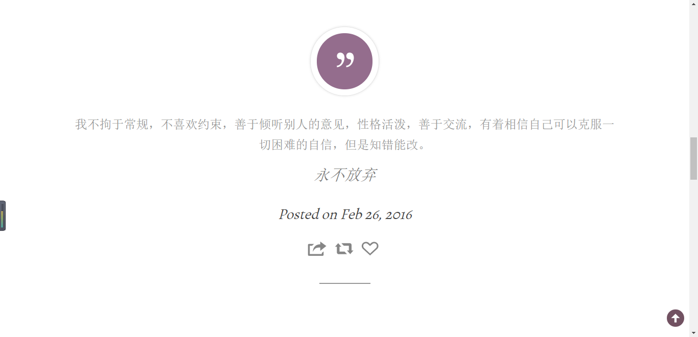
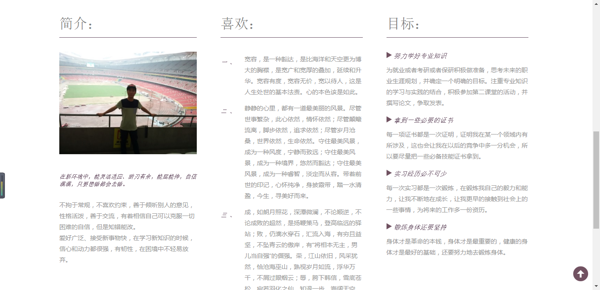
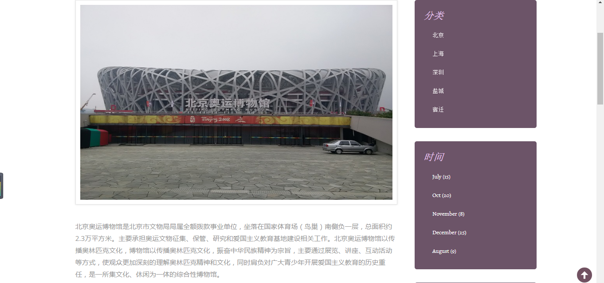

# 第一次网页设计作品

### 作品为静态网页，无数据库交互，样式布局及部分代码有参考模板，如有侵权，请联系我删除

- **主要分为六个模块，分别为首页、个人主页、经历、感悟、美文欣赏、与我联系**

- **首页**：分为上中下几部分，展示个人喜欢的格言、兴趣爱好、性格等信息展示，简单截图展示一下

- **个人主页**：主要展示个人简介、目标及喜欢的优美文字

- **个人经历**：展示个人活动、比赛等事情

- **个人感悟**：记录旅游所感

- **美文欣赏**：自己遇到的一些美文及优美语句

- **与我联系**：自己的联系方式，便于其他人联系
